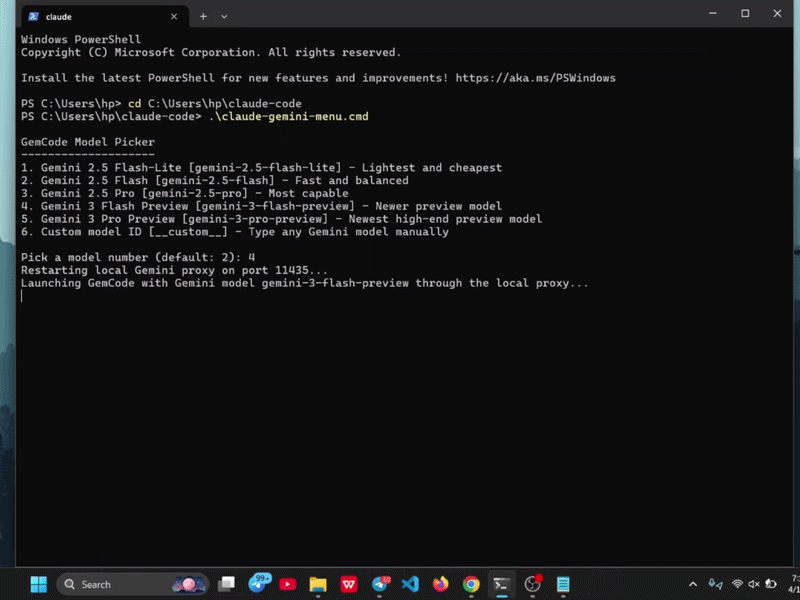

# GemCode



GemCode lets you run the Claude Code terminal app with Gemini models on Windows.
It keeps the Claude Code interface and tool workflow, but routes model requests through a local Anthropic-compatible Gemini proxy.

## What this project does

- launches Claude Code against Gemini instead of Anthropic's hosted models
- supports multiple Gemini model choices
- keeps normal Claude Code commands and tools available
- adds Gemini-backed web search through Google Search grounding
- includes small mascot-testing helpers for the terminal UI

## How it works

1. Claude Code is installed globally on your machine.
2. `claude-gemini.cmd` starts a local proxy from this repo.
3. Claude Code talks to that local proxy as if it were an Anthropic-compatible backend.
4. The proxy forwards requests to Gemini using your `GEMINI_API_KEY`.

## Exact setup used for this repo

- Windows PowerShell
- Node.js on `PATH`
- Claude Code installed globally with npm
- Gemini API key stored in `GEMINI_API_KEY`

Anthropic's current setup docs still show the npm install path for Claude Code:

```powershell
npm.cmd install -g @anthropic-ai/claude-code
```

If your Gemini key is not set yet, run:

```powershell
setx GEMINI_API_KEY "your_key_here"
```

Then close PowerShell and open a new one.

## Run it exactly like this

From this folder:

```powershell
.\claude-gemini.cmd
```

That starts GemCode with the current default Gemini model.

## Pick a model

If you want a small menu before launch, run:

```powershell
.\claude-gemini-menu.cmd
```

Current menu options:

- `gemini-2.5-flash-lite`
- `gemini-2.5-flash`
- `gemini-2.5-pro`
- `gemini-3-flash-preview`
- `gemini-3-pro-preview`
- custom model ID entry

To change the model for only the current terminal:

```powershell
$env:CLAUDE_GEMINI_MODEL="gemini-2.5-pro"
.\claude-gemini.cmd
```

To change the default model permanently:

```powershell
setx CLAUDE_GEMINI_MODEL "gemini-2.5-pro"
```

Then open a new PowerShell window.

## Web search

GemCode supports web search in Gemini mode through Google Search grounding behind Claude Code's existing `WebSearch` tool.

Example:

```text
Search the web for the latest Gemini 2.5 Flash pricing and give me sources.
```

Notes:

- search is backed by Gemini's Google Search grounding
- citations and links work, but behavior is not identical to Anthropic's native backend
- domain filters are best-effort in this proxy path

This repo includes `.claude/settings.json` so `WebSearch` is already allowed at the project level.

## Mascot tools

Edit the mascot here:

```text
src/components/LogoV2/Clawd.tsx
```

Preview the current mascot:

```powershell
.\preview-mascot.cmd
```

Sync the mascot into the installed GemCode runtime:

```powershell
.\sync-mascot.cmd
```

Then relaunch:

```powershell
.\claude-gemini.cmd
```

## Repo files

- `claude-gemini.cmd`: simple launcher
- `claude-gemini.ps1`: main launcher logic
- `claude-gemini-menu.cmd`: launcher with a model picker
- `claude-gemini-menu.ps1`: model picker logic
- `gemini-anthropic-proxy.mjs`: local Anthropic-compatible Gemini proxy
- `preview-mascot.cmd`: mascot preview helper
- `sync-mascot.cmd`: mascot sync helper
- `mascot-tools.ps1`: shared mascot helper logic
- `stop-gemini-proxy.cmd`: stops the local proxy if needed

## Troubleshooting

If GemCode says your Gemini key is missing, set `GEMINI_API_KEY` and open a new terminal.

If you want to stop the proxy manually, run:

```powershell
.\stop-gemini-proxy.cmd
```

If the model ever says it cannot do web search even though `WebSearch` is allowed, restart with:

```powershell
.\stop-gemini-proxy.cmd
.\claude-gemini.cmd
```

If you want to inspect proxy activity, check:

```powershell
Get-Content .\gemini-proxy.log -Tail 50
Get-Content .\gemini-proxy.err.log -Tail 50
```
